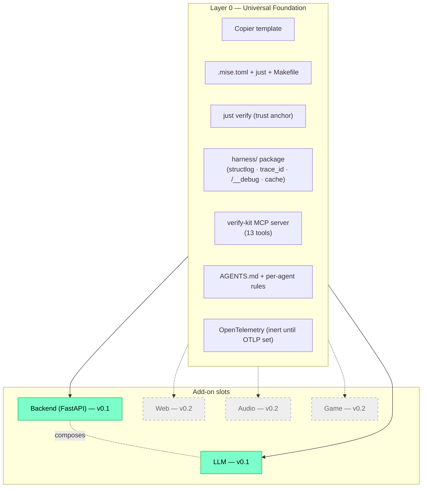

# verify-kit

> A Copier-based scaffold where `just verify` is the ground truth — both human and coding agent verify the same way.

[](https://github.com/m2moiz/verify-kit/actions/workflows/template-selftest.yml)
[](https://securityscorecards.dev/viewer/?uri=github.com/m2moiz/verify-kit)
[](https://codecov.io/gh/m2moiz/verify-kit)
[](LICENSE)


## Quickstart

```bash
uv tool install copier --with copier-template-extensions
copier copy --trust gh:m2moiz/verify-kit my-project
cd my-project && mise trust && mise install && uv sync --extra dev && just verify
```

The first line installs Copier with the `copier-template-extensions` Jinja extension that verify-kit's `copier.yml` declares under `_jinja_extensions`. The second line renders the template into `my-project/`. The third line runs the per-project bootstrap: `mise trust` is required on first run because mise refuses to load untrusted `.mise.toml` files for safety; `mise install` resolves the pinned Python / Node / Just toolchain; `uv sync --extra dev` installs the dev dependency group (pytest, ruff, etc.) that `just verify` needs; and `just verify` exiting `0` is the contract that the scaffold is healthy on your machine. The `--trust` flag on `copier copy` is required because Copier 9.15+ refuses to load templates declaring `_jinja_extensions` (or `_tasks`) without explicit operator opt-in; the repo's own CI uses the same flag.

## Why this exists

Claude Code and every other autonomous coding agent is half-blind: it cannot click buttons, hear audio, or watch a UI render. Without verifiable feedback loops baked into a project from day one, "done" is unfounded — and the human becomes the unpaid QA function. verify-kit ships a project skeleton where every feature is verifiable end-to-end without human intervention, **and** a human developer in a terminal or IDE has an equally first-class experience.

## Philosophy

Two principles drive every decision in the template:

1. **`just verify` is the only ground truth.** Pretty terminal output, clickable IDE errors, structured JSON for agents, semantic exit codes — all of them derive from the same verifier run. A green `just verify` means the same thing to a human, to Claude Code, and to CI.
2. **Dual first-class citizenship.** Every shipped feature must answer the same six questions (see the [Dual-audience checklist](#dual-audience-checklist) below) for both the human and the agent. If any answer is blank, the feature is incomplete.

verify-kit is intentionally a **scaffold, not a framework**. You consume it once via `copier copy`, you own the generated files, and you pull template improvements later via `copier update` — three-way merge, no runtime dependency on the template repo.

## Add-on inventory

The template is a Universal Foundation plus optional add-on slots, selected at scaffold time by Copier prompts.

| Copier prompt | Generated files | Shipped in |
|---|---|---|
| (always on — Universal Foundation) | `.mise.toml`, `justfile`, `Makefile`, `harness/`, `AGENTS.md`, `.vscode/`, `.editorconfig`, OTel scaffold, Claude Code hooks | v0.1 |
| `has_backend=true` | `app/` (FastAPI), `Dockerfile`, `docker-compose.yml`, `.env.example` (root), Schemathesis + Testcontainers configs | v0.1 |
| `has_llm=true` (+ `llm_backend` choice) | `app/api.py` extensions (`/summarize`), `harness/llm/`, vcrpy cassettes, Promptfoo config, Langfuse env slot | v0.1 |
| `has_web=true` | Next.js / React frontend tooling | Deferred (v0.2) |
| `has_audio=true` | ffprobe / Whisper round-trip / Chromium fake-audio | Deferred (v0.2) |
| `has_game=true` | Godot / gdUnit4 / JavaScriptBridge | Deferred (v0.2) |

`has_backend` + `has_llm` compose: enabling both gives you a FastAPI app with an `/summarize` LLM endpoint, OTel-instrumented, with Schemathesis fuzzing the OpenAPI schema your LLM app actually serves.

## Architecture



The Universal Foundation is always rendered. Solid arrows point to shipped add-on slots (Backend + LLM, v0.1). Dashed arrows point to deferred slots (Web/Audio/Game, v0.2). The `Backend -.composes.- LLM` edge captures that when both are enabled, the LLM add-on lands inside the FastAPI app rather than as a standalone CLI.


*VS Code Problems panel showing clickable Ruff + pyright errors via verify-kit's custom problem matchers — the human side of the dual-audience contract.*

## Dual-audience checklist

Every shipped feature must answer all six rows below. If any cell would be blank, the feature is incomplete. The same six rows live in the PR template as a reviewer-enforced checkbox list.

- **1. Human in terminal sees:** Pretty colorized output via isatty; spinner; failed checks summarized with one-line next-action hint.
- **2. Human in VS Code sees:** SARIF in Problems panel, JUnit in Testing sidebar — no agent involvement required.
- **3. Agent calling programmatically gets:** Deterministic JSON with stable schema (introspectable via `describe`), error envelope `{code, message, hint, fix_command, docs_url}`, semantic exit codes.
- **4. Agent has a fix path:** Failed check returns `fix_command`; `fix_propose` MCP tool returns unified diff with rationale; agent can re-verify without human round-trip.
- **5. Human can override agent:** Every fix is `--dry-run`-able; destructive MCP tools annotated `destructiveHint: true`; Stop-hook escape hatch (`VERIFY_KIT_SKIP=1`); audit log in `.verify-kit/audit.jsonl`.
- **6. Both can collaborate mid-flow:** Same `verify-kit trace --last` works for both; state file-backed in `.verify-kit/` so human can `cat` while agent runs.

## Security

verify-kit ships a starter-grade security scaffold on the Backend + LLM add-ons. The shape is defensive-by-default: every route is token-gated, every LLM input is sanitized, and the LLM endpoint deliberately rejects naive injection payloads. The defenses are starter scaffolds, not bulletproof production hardening — see the per-section caveats.

### Route authentication (`X-VerifyKit-Token`)

When `has_backend=true`, the FastAPI app installs `require_auth` as a **global dependency** that gates every route except `GET /healthz`. The contract:

- **HTTP header:** `X-VerifyKit-Token`
- **Env var:** `VERIFYKIT_AUTH_TOKEN` (read into `Settings.VERIFYKIT_AUTH_TOKEN`)
- **Excluded route:** `GET /healthz` — short-circuits inside `require_auth` so docker-compose healthchecks and CI smoke probes keep working.
- **Dev fallback:** if the token is unset **and** `ENV=dev`, requests are allowed with a one-line warning logged once. This preserves zero-config local development.
- **Non-dev with unset token:** HTTP 503 (config error — distinct from 401 auth error) so a misconfigured production deployment fails loudly rather than silently accepting unauthenticated traffic.

Token comparison uses `secrets.compare_digest` (constant-time). Generate a token with `openssl rand -hex 32` and put it in `.env` at the project root.

### Input defenses on `/summarize`

When `has_llm=true`, the `/summarize` endpoint layers four input defenses inside `SummarizeRequest._strip_and_check` (runs at Pydantic validation, before the LLM call):

- **Length cap:** `Field(max_length=5000)` — bounds attack surface and LLM cost.
- **Control-character strip:** `_CONTROL_CHARS` regex strips `\x00-\x08`, `\x0b`, `\x0c`, `\x0e-\x1f`, `\x7f` so an attacker cannot smuggle markers past the denylist by inserting null bytes.
- **Content-Type enforcement:** FastAPI's Pydantic-typed parameter rejects non-JSON bodies with 422 (no middleware needed).
- **Injection-marker denylist:** `_INJECTION_MARKERS` (three regexes) rejects obvious "ignore previous instructions" / ChatML / `### system` payloads with 422.

> verify-kit's `/summarize` ships starter-grade input defenses (length cap, control-char strip, obvious-injection denylist). These demonstrate the pattern but are **not bulletproof**. Consumers handling untrusted input should layer additional defenses: output validation, system-prompt hardening, and an LLM-based classifier prefilter. See OWASP LLM01.

### Input hardening on `/echo`

`/echo` ships a parallel but smaller hardening layer in `EchoRequest._strip_control`:

- **Length cap:** `Field(max_length=5000)`.
- **Control-character strip:** `_CONTROL_CHARS_ECHO` (same character class as `/summarize`, distinct identifier so a rename in either module does not break the other).
- **Content-Type enforcement:** FastAPI Pydantic default.

The injection-marker denylist is **deliberately NOT applied** to `/echo` because `/echo` does not call an LLM — applying LLM-specific markers to a generic reflection endpoint would produce false positives on legitimate user input.

## Updating an existing project

Pull template improvements into a previously-scaffolded project:

```bash
copier update
```

Run from the project root. Copier reads `.copier-answers.yml` (the file that records which prompts you answered and which template version you scaffolded from), fetches the latest verify-kit ref, and runs a three-way merge against your local edits. Files you have never touched update silently; files you have edited produce merge conflicts surfaced as `.rej` files alongside the originals.

**Conflict resolution:** open each `.rej` file, reconcile the diff into the live file, delete the `.rej`, then re-run `just verify` to confirm the merged state is green.

**When to expect breaking changes:** every release with a non-empty "Breaking changes for consumers" callout in [CHANGELOG.md](CHANGELOG.md) names the exact migration step (re-answer a renamed prompt, delete a deprecated file, etc.). Releases with `_None._` in that section update cleanly with no manual steps.

## Troubleshooting

### Symptom: just verify fails on a fresh scaffold

Confirm `mise install` completed (`mise current` should list the project's Python + Node versions). Re-run with `just verify --debug` for full output. Inspect `.verify/report.json` for the first failing check name and copy the `fix_command` field — it's the canonical next action.

### Symptom: copier update creates merge conflicts

Expected whenever your local edits diverge from the template. Resolve each `.rej` file by hand, delete the `.rej`, re-run `just verify` to confirm. If the conflict is in `.copier-answers.yml` (rare), accept the new key names and copy your old values across; the CHANGELOG entry for that release names what changed.

### Symptom: 401 from /summarize or /__debug/*

The auth token is missing or wrong. Set `VERIFYKIT_AUTH_TOKEN` in `.env` at the project root, then re-issue your request with the header attached:

```bash
curl -H "X-VerifyKit-Token: $VERIFYKIT_AUTH_TOKEN" http://localhost:8000/summarize -d '{"text":"hello"}'
```

See the [Route authentication](#route-authentication-x-verifykit-token) section above for the full contract.

## Releases & contributing

- [CHANGELOG.md](CHANGELOG.md) — strict SemVer with a "Breaking changes for consumers" callout per release
- [CONTRIBUTING.md](CONTRIBUTING.md) — smoke-test loop, add-a-check guide, commit-message contract
- [CODE_OF_CONDUCT.md](CODE_OF_CONDUCT.md) — Contributor Covenant 2.1
- [SECURITY.md](SECURITY.md) — vulnerability reporting
- [LICENSE](LICENSE) — MIT
